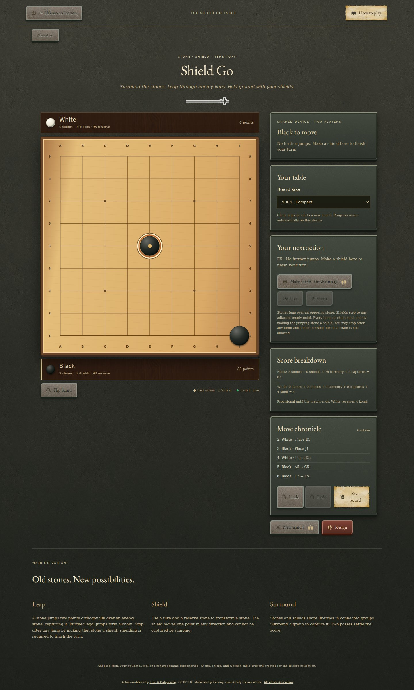
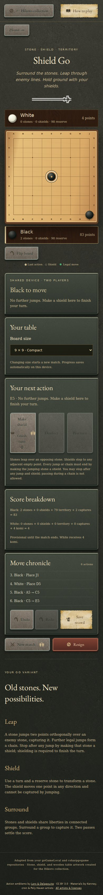

# Mandatory shields after jumps

Every jump keeps the jumping player’s turn until that stone is made into a shield. A player may shield after any jump to stop a chain early. With no further jumps, the shield is mandatory. Passing and unrelated moves are rejected.

All 57 tests pass, including shared online state, reconnecting during a chain, reserves, repetition and saved journals. The browser smoke check covers early and final shielding, refresh, Escape, undo/redo and layout on 9×9 and 13×13 boards at 390px and 1440px.

