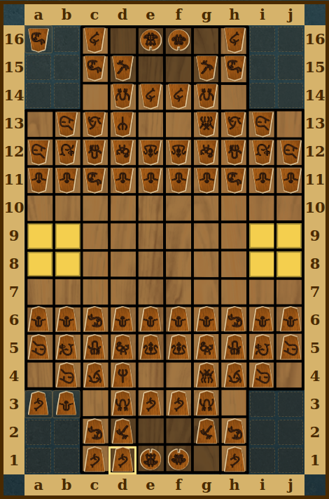
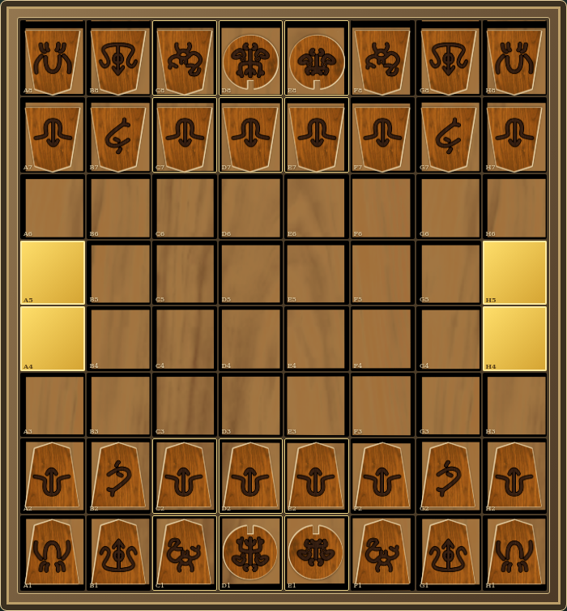

# Supplied wooden Hikoro artwork

Updates the full Hikoro game and Academy to use the nineteen supplied piece images. Pieces use a shared 28% brightness boost, slight contrast increase, and fine cream edge through CSS; the supplied image pixels remain unchanged. Both armies share one asset per type, with ownership shown by rotation relative to the viewer. The full game uses the supplied 10 × 16 board; captured hands occupy the twelve unused corner cells at each end. Duplicate types display a count. Academy retains its 8 × 8 geometry and uses the supplied wood texture.

## Previews

[Full Hikoro desktop page](hikoro-desktop-page.jpg) · [Full Hikoro phone page](hikoro-phone-page.jpg)

[Academy desktop page](academy-desktop-page.jpg) · [Academy phone page](academy-phone-page.jpg)

The full-game preview uses a controlled captured-hand fixture and an engine-accepted drop to show corner placement. Home cards show engine-validated real match positions.

## Validation

- All 57 existing engine/socket tests passed.
- All 18 mobile interaction scenarios passed (390 × 844, 320 × 740, 740 × 390), including return to desktop.
- Dedicated desktop and phone artwork checks: corner selection/drop, duplicate counts, board re-render, overflow pages, Black-seat orientation, clock-header ordering, Academy flip, no JavaScript errors or broken images.
- All twenty lossless WebP files match the supplied PNGs pixel for pixel in RGBA; originals were not modified.
- Browser emulation was used; physical-device testing remains outstanding.

No AI imagery was generated. Original artist name and license were not supplied; the credits record owner-supplied provenance and pending attribution without inventing authorship or license terms.

This is a review preview, not a merged or deployed release.
